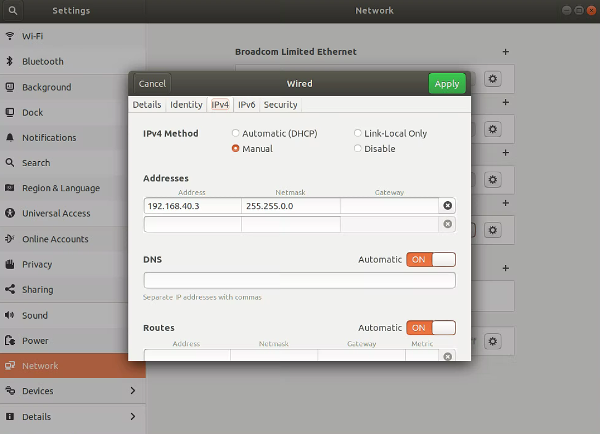

# USRP Setup Tutorial

## Introduction

Our tutorial is based on ubuntu18.04 OS and USRP X310.

Here are the recommended uhd and gnuradio versions (based on release notes and community recommendations)

| Gnuradio Version |     UHD Version     |
| :--------------: | :-----------------: |
|      3.7.x       | UHD 3.9.x - 3.15.x  |
|      3.8.x       | UHD 3.14.x - 4.0.x  |
|      3.9.x       | UHD 3.15.x - 4.1.x  |
|      3.10.x      | UHD 4.0.x or higher |

The current Ubuntu18.04 release only supports gnuradio3.8 at the minimum. Therefore, the gnuradio version is set to 3.8 and the uhd version is 3.9.7.

Ettus Research UHD Releases: https://github.com/EttusResearch/uhd/releases

GNU Radio Releases: https://github.com/gnuradio/gnuradio/releases

Ettus Knowledge Base: https://kb.ettus.com/

## Environment setup

### Start USRP

1. Connect the USRP device to the Ethernet port of the host using a network cable and ensure that the device is supplied with external power (N210/X310 requires a separate power adapter)
2. Assign a static IP address to the Ethernet interface of the host on the same subnet as the USRP. For example, the ip address of the Ethernet interface on the host is 192.168.40.2. Use Manual, cancel DHCP, and set the Netmask to 255.255.0.0. Set the ip address of the network adapter connecting to the USRP to 192.168.40.xxx (the ip address cannot be the same).



​	By the way, you can use this command to find the IP of the USRP.

```bash
ifconfig
```

3. Run the following command to check whether the connection is successful.

```bash
uhd_find_devices
```

​	and then it will output:

```bash
--------------------------------------------------
-- UHD Device 0
--------------------------------------------------
Device Address:
    type: x300
    addr: 192.168.40.2
    fpga: HGS
    name: UserA
    serial: 3104FBD
    product: X310
```

4. Common problems: 
   - **The device cannot be pinged**: ensure that the IP addresses of the host and device are on the same subnet.
   - **Device not detected or communication failure**: ensure UHD driver is installed and firmware updated. (**More on that later**)


### UHD

#### UHD  Installation

This section mainly refers to the following cloud documentation, link is: https://docs.qq.com/doc/DS2RZVmhza0xtdW1y

1. pre-requisites:

```bash
sudo apt-get install autoconf automake build-essential ccache cmake cpufrequtils doxygen ethtool \
g++ git inetutils-tools libboost-all-dev libncurses5 libncurses5-dev libusb-1.0-0 libusb-1.0-0-dev \
libusb-dev python3-dev python3-mako python3-numpy python3-requests python3-scipy python3-setuptools \
python3-ruamel.yaml 
```

2. prepare python env:

```bash
conda activate xxx
conda install python=3.8
# find / -name Python.h 2>/dev/null
pip install mako requests numpy
```

3. install from source:

```bash
git clone https://github.com/EttusResearch/uhd.git
cd uhd/host
# to build srsRAN, we need fpga 36.0 version, which corresponds to uhd 3.15
git checkout v3.15.0.0
mkdir build && cd build
cmake -DPYTHON_EXECUTABLE=/home/usrp2/miniconda3/envs/usrp/bin/python -DPYTHON_INCLUDE_DIR=/home/usrp2/miniconda3/envs/usrp/include/python3.8/ -DPYTHON_LIBRARY=/home/usrp2/miniconda3/envs/usrp/lib/libpython3.8.so ..
make
sudo make install
sudo ldconfig
```

4. download fpga images:

```bash
# this only download the fpga images corresponding to the uhd version
uhd_images_downloader
```

5. load image:

```bash
uhd_image_loader --args="type=x300,addr=192.168.40.2"
```

6. **reboot USRP** and check if image is loaded correctly:

```bash
uhd_usrp_probe
```

**Note** that the restart in Step 6 takes about one minute. If the restart interval is too short, the uhd image cannot be installed and configured properly. As a result, the USRP network port cannot be identified. (Start USRP common problems mentioned)

If a problem occurs, see **Device Recovery** in the next section.


Reference link: https://files.ettus.com/manual/page_build_guide.html

The above steps are only for reference, the specific use needs to replace the correct parameters and paths, more specific questions please see jianfu documentation.

#### Devices Recovery

Prepare the TypeB data cable. For details, see http://kb.ettus.com/X300/X310_Device_Recovery, a method to burn uhd image.


### Gnuradio

#### Gnuradio Installation

Before installing GNU Radio, make sure the system is up to date:

```bash
sudo apt update
sudo apt upgrade
```

The Ubuntu official repository and GNU Radio PPA provide pre-compiled GNU Radio packages for rapid deployment.

```bash
sudo add-apt-repository ppa:gnuradio/gnuradio-releases
sudo apt update
```

Install gnuradio.

```bash
sudo apt install gnuradio
```

Check whether GNU Radio is installed successfully.

```bash
gnuradio-config-info --version
```

Run the following command to launch the GNU Radio Companion (GRC) graphical interface.

```bash
gnuradio-companion
```

#### Replace the Version of Gnuradio

Take the example of updating gnuradio3.7 to gnuradio3.8.

If you have another version of GNU Radio installed on your system, it is recommended to uninstall it first.

```bash
sudo apt remove --purge gnuradio
```

Run the following command to add the GNU Radio PPA to your system.

```bash
sudo add-apt-repository ppa:gnuradio/gnuradio-releases
sudo apt update
```

Check if version 3.8 is included in the PPA.

```bash
apt-cache policy gnuradio
```

You should see similar output, listing multiple available versions, such as:

```bash
gnuradio:
  Installed: (none)
  Candidate: 3.10.3.0-1~ubuntu18.04
  Version table:
     3.10.3.0-1~ubuntu18.04 500
        500 http://ppa.launchpad.net/gnuradio/gnuradio-releases/ubuntu bionic/main amd64 Packages
     3.9.5.0-1~ubuntu18.04 500
        500 http://ppa.launchpad.net/gnuradio/gnuradio-releases/ubuntu bionic/main amd64 Packages
     3.8.5.0-5~ubuntu18.04 500
        500 http://ppa.launchpad.net/gnuradio/gnuradio-releases/ubuntu bionic/main amd64 Packages
```

Make sure version 3.8.x exists.

Specify the version 3.8 to be installed (for example, 3.8.5.0) :

```bash
sudo apt install gnuradio=3.8.5.0-5~ubuntu18.04
```

**Note** that the specific command depends on the prompt that is displayed.

Check whether GNU Radio is installed correctly and the version number:

```bash
gnuradio-config-info --version
```
